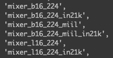

# Savlr Pruning on MLP-Mixer and Vision Transformer

**Follow [Pytorch Image Models](https://github.com/rwightman/pytorch-image-models) codebase to install required packages and see List of  Models with Pretrained Weights**

[Available model list](model_list.txt)

---

## [MLP-Mixer](https://arxiv.org/pdf/2105.01601.pdf)

### Available models

### Run Savlr pruning on MLP-Mixer Model

- Check [run_slr.py](run_slr.sh)

---
## [Swin Transformer](https://github.com/microsoft/Swin-Transformer)

### Available models

### Run Savlr pruning on Swin Transformer Model

- Check [run_slr.py](run_slr.sh)